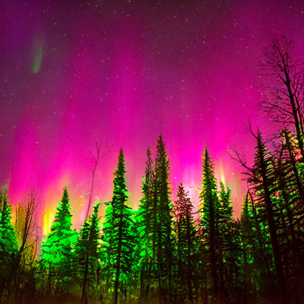

# Synthetic Image Generation, Preprocessing, and Flux Model Forward Pass

## Overview
This project demonstrates the following AI/ML techniques:
1. **Synthetic Image Generation** using Stable Diffusion (via Hugging Face's `diffusers` library).
2. **Image Preprocessing** including resizing and normalization.
3. **Flux-based Neural Network Forward Pass** for image processing in Julia.

## Setup Instructions
Follow these steps to set up and run the project on your local machine.

### 1. Environment Setup
#### Python (for image generation & preprocessing)
Ensure you have Python 3.8+ installed. Then, install the required dependencies:
```bash
pip install torch diffusers matplotlib pillow opencv-python
```

#### Julia (for Flux-based model)
Ensure you have Julia installed (version 1.7+ recommended). Then, install required Julia packages:
```julia
using Pkg
Pkg.add(["Flux", "Images", "ImageIO"])
```

### 2. Synthetic Image Generation
#### Description:
The script `image_generation.py` generates synthetic images using a Stable Diffusion model.

#### Execution:
Run the script:
```bash
python image_generation.py
```
#### What It Does:
- Loads the Stable Diffusion model (`runwayml/stable-diffusion-v1-5`).
- Uses a creative text prompt: **"A vibrant forest landscape with colorful trees and a bright sky"**.
- Generates 3 synthetic images and saves them as `generated_forest_image_1.png`, `generated_forest_image_2.png`, etc.
- Displays the generated images using Matplotlib.

#### Example Output:
Generated Images:




### 3. Image Preprocessing
#### Description:
This step ensures the generated images are correctly formatted for the neural network.

#### Steps Included:
- **Resizing**: Images are resized to 28×28 pixels.
- **Grayscale Conversion**: Converts images to grayscale for simplicity.
- **Normalization**: Converts images to a tensor format.


### 4. Flux-Based Neural Network (Forward Pass)
#### Description:
The script `flux_model.jl` demonstrates a forward pass of a neural network built using Flux.

#### Execution:
Run the script in Julia:
```julia
julia flux_model.jl
```
#### What It Does:
- Loads one preprocessed image (`generated_forest_image_2.png`).
- Converts it to grayscale and resizes it to 28×28.
- Defines a simple CNN with convolutional layers and max-pooling.
- Runs a forward pass through the network and outputs probabilities.

#### Example Output:
Model Output:


## Challenges & Assumptions
1. **GPU Dependency**: If running locally without a GPU, use Google Colab for Stable Diffusion.
2. **Image Format Assumption**: The model assumes grayscale images with dimensions (28×28).
3. **Image Generation**:The images generated are valid representations of the given prompt.
4. **The Flux model is untrained**: so outputs are not meaningful predictions.

## Project Structure
```
├── image_generation.py    # Python script for Stable Diffusion image generation
├── flux_model.jl          # Julia script for Flux-based model forward pass
├── generated_images/      # Folder containing generated images
├── preprocessed_images/   # Folder containing preprocessed images
└── README.md              # Project documentation
```

## Conclusion
This project effectively demonstrates Stable Diffusion-based image synthesis, preprocessing, and a simple neural network model in Flux for image analysis. The approach is modular, making it easy to extend for training or other applications.

